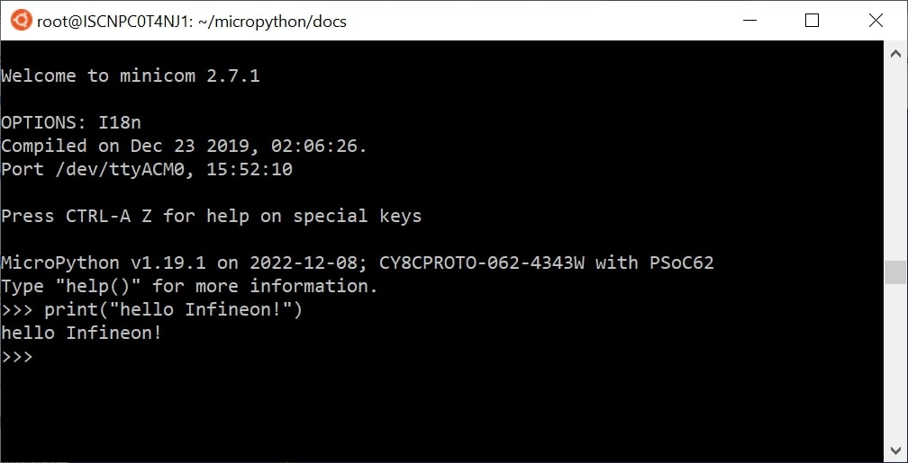

.. _psoc6_mpy_usage:

Working with MicroPython
=========================

With MicroPython already installed in your board there are several flavors and
tools to work with micropython (:ref:`_psoc6_mpy_install <Installing MicroPython>`). 
In this section we introduce some of the ways you can work with MicroPython.

Serial prompt (REPL Mode)
-------------------------

With MicroPython deployed on your PSoC6™ board, you can access the REPL mode using
the USB-UART interface from the on-board debugger. 

REPL stands for Read Evaluate Print Loop, and is the name given to the interactive MicroPython
prompt that you can access on the PSoC6™ board. Using the REPL is by far the easiest way to test out your
code and run commands. This is equivalent to running the *python* commmand (without passing a script) in the command line terminal of your machine.

Use your preferred serial terminal software to connect to the board. Examples of serial
terminal tools are `Putty <https://www.putty.org/>`_, which works for Windows and
Unix machines; or other platform specific such as `Tera Term <https://ttssh2.osdn.jp/index.html.en>`_, or `minicom <https://en.wikipedia.org/wiki/Minicom>`_. 

Configure the serial connection with **115200 bauds** and **8-N-1** (8 bits frame, no parity and 1 stop
bit), and connect to the board port, the MicroPython REPL prompt will appear, and you can start
typing some python code :) 

Running a script
----------------

In order to implement more ellaborated programs, and use the embedded device stand-alone you can write
python scripts.

There are several IDEs that you can install that integrate a text editor with the tools to run your
python script in your MicroPython device, as well as handling the files system of your MicroPython
device. The most popular are:

* `Thonny <https://thonny.org/>`_
* `Mu Editor <https://codewith.mu/>`_
* `Arduino Lab for MicroPython <https://labs.arduino.cc/en/labs/micropython>`_

Alternatively, MicroPython offers :ref:`mpremote` as a command line tool that can be as well used for executing
scripts. Find more the information it the provided link.

In MicroPython there are primarily two ways to execute a script:  

Host REPL mode 
~~~~~~~~~~~~~~

In this mode, the MicroPython PSoC6™ board is connected through the serial interface to the
host development machine. 
Each of the line will be executed in the controller. Any output like print messages in your application or
exceptions will be send through the serial connection to the host machine, which will display them
in the serial terminal console. 

The REPL mode is used, but the IDE or command line tool will take care of sending
each line of the script and process its output to show it in the terminal.
 
On-target file system mode
~~~~~~~~~~~~~~~~~~~~~~~~~~

When the board provides a file system and data storage, you will have the possibility to store your
scripts in the device. 

You can split your program in different files, and use import to make use of the provided features
in other scripts. 
To run a script in the device at boot, there are two scripts that need to be present in the file
system: ``boot.py`` and ``main.py``.

*Section to be completed ...*
