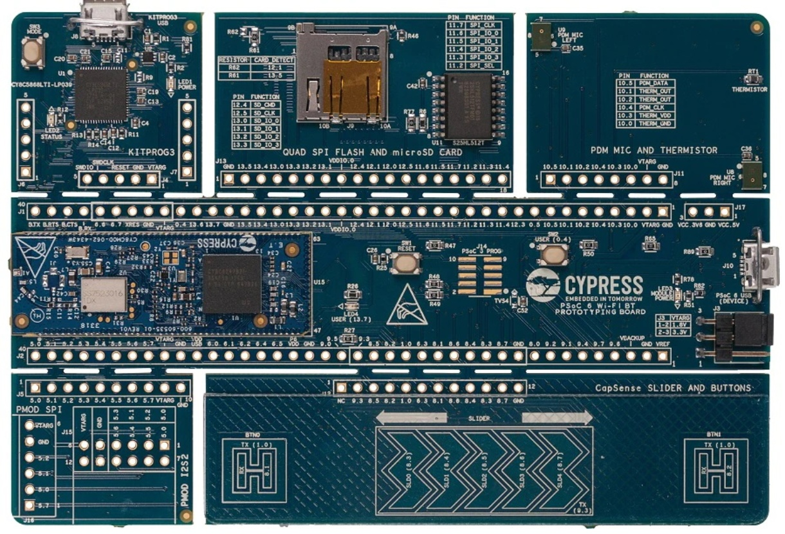

.. _psoc6_quickref:

Quick reference for the PSoC6™
==============================

The CY8CPROTO-062-4343W PSoC6™ Board.

Below is a quick reference for PSoC6™ boards. If it is your first time
working with this port it may be useful to get an overview of the microcontroller:

.. toctree::
   :maxdepth: 1

   general.rst
   intro.rst
   installation.rst
   mpy-usage.rst

General board control
---------------------

The MicroPython REPL is accessed via the USB serial port. Paste mode (ctrl-E) is useful to paste a
large slab of Python code into the REPL. 

This port implements most of the methods described in the :mod:`machine` module. Tab-completion is useful to
find out what methods an instantiated object has. 

The :mod:`machine` module::

    import machine

    machine.freq()          # get the current frequency of the CPU
    
..
    TODO: add more machine module examples when implemented.    
    machine.freq(240000000) # set the CPU frequency to 240 MHz

..
    TODO: add ``psoc6`` module when implemented.    

Delay and timing
----------------

Use the :mod:`time <time>` module::

    import time

    time.sleep(1)           # sleep for 1 second
    time.sleep_ms(500)      # sleep for 500 milliseconds
    time.sleep_us(10)       # sleep for 10 microseconds
    start = time.ticks_ms() # get millisecond counter
    delta = time.ticks_diff(time.ticks_ms(), start) # compute time difference
    start = time.ticks_us() # get microsecond counter
    delta = time.ticks_diff(time.ticks_us(), start) # compute time difference

Timers
------

*Feature unavailable. Placeholder. To be completed.*

Pins and GPIO
-------------

Most of the methods (functions) and constants given in the :ref:`machine.Pin <machine.Pin>` class have been implemented in this port. Any functions in addition to those or function calls with ambiguous list of parameters have been documented here with suitable examples. 

The constructor
^^^^^^^^^^^^^^^
The constructor can be called in different flavors and configurations based on the number of arguments (parameters) passed. 

An instance of the :mod:`machine.Pin` class can be created by invoking the constructor with all the necessary parameters to fully configure the ``Pin``. 

::

    from machine import Pin

    p0 = Pin('P13_7', Pin.OUT, Pin.PULL_DOWN, value=STATE_LOW)   # create output pin on pin P13_7, 
                                                                 # with pull-down resistor enabled,
                                                                 # with initial value 0 (STATE_LOW)     

Additionally, with any combination of parameters (except the Pin number or ``id`` which should be passed mandatorily), a :mod:`machine.Pin` object with various configuration levels can be instantiated. In these cases, the :meth:`Pin.init` function has to be called proactively to set the other necessary configurations, as needed.

Moreover, a pre-configured pin object can be repurposed by calling the :meth:`Pin.init` function.

::

    from machine import Pin

    p0 = Pin('P13_7')                    # create pin object for pin P13_7. 
    p0.init(p0.OUT, p0.PULL_DOWN)        # set pin as output and enable pull-down resistor.
    p0.low()                             # set value low.     

Similar to CPython, the parameters can be passed in any order if keywords are used. On the other hand, in case of a non-keyword assignment if a parameter is not to be set, a ``None`` is to be passed in its place.

::

    from machine import Pin

    p0 = Pin(id='P13_7', value=STATE_LOW, pull=Pin.PULL_DOWN, mode=Pin.OUT)     # create output pin on pin P13_7, 
                                                                                # with pull-down resistor enabled,
                                                                                # with initial value 0 (STATE_LOW) 

    p1 = Pin('P0_0', Pin.OUT, None, value=STATE_HIGH)                           # create output pin on pin P0_0, 
                                                                                # with pull as NONE,
                                                                                # with initial value 1 (STATE_HIGH)                                                                       

Note that the parameters such as ``value`` can only be passed as keyword arguments.  

..
    TODO: add ``drive`` and ``alt`` when implemented

Methods
^^^^^^^

.. method:: Pin.toggle()

   Set pin value to its complement.

Constants
^^^^^^^^^
The following constants are used to configure the pin objects in addition to the ones mentioned in the :mod:`machine.Pin` class.

.. data:: Pin.STATE_LOW
          Pin.STATE_HIGH
          
    Selects the pin value.

Real time clock (RTC)
---------------------

See :ref:`machine.RTC <machine.RTC>` ::

    from machine import RTC

    rtc = RTC()
    rtc.init((2023, 1, 1, 0, 0, 0, 0, 0)) # initialize rtc with specific date and time,
                                          # eg. 2023/1/1 00:00:00
    rtc.datetime((2017, 8, 23, 2, 12, 48, 0, 0)) # set a specific date and
                                                 # time, eg. 2017/8/23 1:12:48
    rtc.datetime() # get date and time
    rtc.now() # get current date and time

.. note::
    Setting a random week day in 'wday' field is not valid. The underlying library implements the logic to always
    calculate the right weekday based on the year, date and month passed. However, datetime() will not raise an error 
    for this, but rather re-write the field with last calculated actual value.
