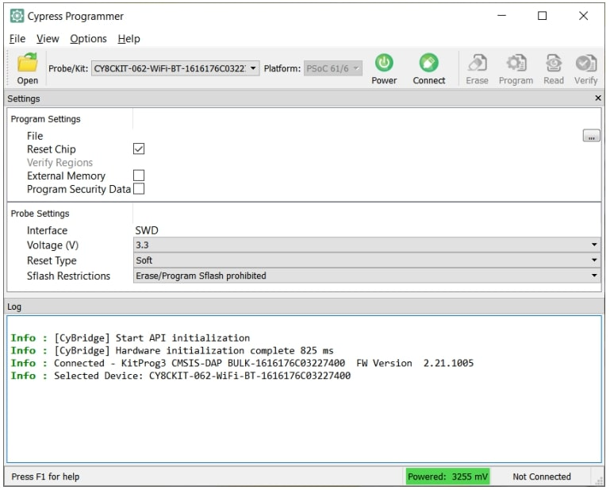
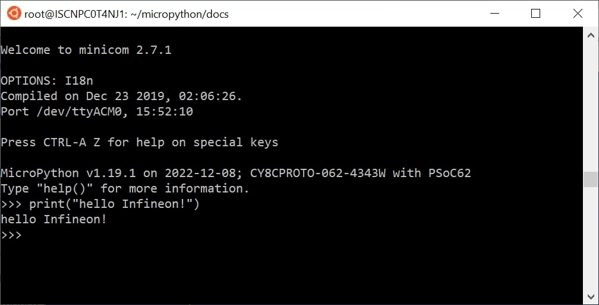

.. _psoc6_intro:

Getting started with MicroPython on the PSoC6™
==============================================

This tutorial will guide you to get started with running MicroPython on the PSoC6™ microcontrollers. 
There are only a few step keeping you away from enjoy the python programming experience together
with the possibilities of PSoC6™ microcontrollers.
Let's get started!

Requirements
------------

The only required hardware is:

* PSoC6™ board of the :ref:`Supported boards` list.
* A microUSB cable.

Getting the firmware
--------------------

The binary *.hex* file is available in the `GitHub release section <https://github.com/jaenrig-ifx/MicroPython/releases>`_. 
All PSoC6™ firmware versions for each of the supported boards can be found there. 

..
    .. image:: img/gh-releases.jpg
..
    :alt: GitHub MicroPython Releases
..
    :width: 360px

Powering the board
------------------

Connect the USB cable to your computer and the micro USB to the board debugger. All the PSoC6™ boards
come with a on-board debugger required for flashing/debugging operations during development. Please refer to the
corresponding board manual of your board.

Deploying the firmware
----------------------

In order to deploy the firmware in the embedded device, the easiest and quickest way is to use the
`Cypress Programmer <https://softwaretools.infineon.com/tools/com.ifx.tb.tool.cypressprogrammer>`_.
It allows to flash a binary in the PSoC6™ microcontrollers family in a few clicks from your Windows,
Linux or Mac OS machine. 
Follow the instructions on the provided link to download and install the tool.

After that, select the downloaded MicroPython firmware *.hex* file to be deployed on the PSoC6™. Then, in
the upper menu, select the connected *Probe/Kit*, click on *Connect*, and finally click on *Program*.
The log section will show the progress and inform when the firmware deployment osn the controller is completed.

For a detailed description on how to use the Cypress Programmer tool, please consult the `Cypress
Programmer User Guide
<https://www.infineon.com/dgdl/Infineon-Infineon_Programmer_4.0_GUI_User_Guide-Software-v01_00-EN.pdf?fileId=8ac78c8c7e7124d1017ed9abca6e365c>`_.

You are all set now to start programming with MicroPython!

.. note::
    Alternatively, users familiar with the ModusToolbox™ toolchain and makefile system can also use the corresponding
    tools for flashing the provided *.hex* file on the target PSoC6™ board. 

Serial prompt
-------------

With MicroPython deployed on your PSoC6™ board, you can access the REPL mode using
the USB-UART interface from the on-board debugger. 

REPL stands for Read Evaluate Print Loop, and is the name given to the interactive MicroPython
prompt that you can access on the PSoC6™ board. Using the REPL is by far the easiest way to test out your
code and run commands. This is equivalent to running the *python* commmand (without passing a script) in the command line terminal of your machine.

Use your preferred serial terminal software to connect to the board. Examples of serial
terminal tools are `Putty <https://www.putty.org/>`_, which works for Windows and
Unix machines; or other platform specific such as `Tera Term <https://ttssh2.osdn.jp/index.html.en>`_, or `minicom <https://en.wikipedia.org/wiki/Minicom>`_. 

Configure the serial connection with **115200 bauds** and **8-N-1** (8 bits frame, no parity and 1 stop
bit), and connect to the board port, the MicroPython REPL prompt will appear, and you can start
typing some python code :) 

Running a script
----------------

In order to implement more ellaborated programs, and use the embedded device stand-alone you can write
python scripts.

There are several IDEs that you can install that integrate a text editor with the tools to run your
python script in your MicroPython device, as well as handling the files system of your MicroPython
device. The most popular are:

* `Thonny <https://thonny.org/>`_
* `Mu Editor <https://codewith.mu/>`_
* `Arduino Lab for MicroPython <https://labs.arduino.cc/en/labs/micropython>`_

Alternatively, MicroPython offers :ref:`mpremote` as a command line tool that can be as well used for executing
scripts. Find more the information it the provided link.

In MicroPython there are primarily two ways to execute a script:  

Host REPL mode 
~~~~~~~~~~~~~~

In this mode, the MicroPython PSoC6™ board is connected through the serial interface to the
host development machine. 
Each of the line will be executed in the controller. Any output like print messages in your application or
exceptions will be send through the serial connection to the host machine, which will display them
in the serial terminal console. 

In this case, the REPL mode is used, but the IDE or command line tool will take care of sending
each line of the script and process its output to show it in the terminal.
 
On-target file system mode
~~~~~~~~~~~~~~~~~~~~~~~~~~

When the board provides a file system and data storage, you will have the possibility to store your
scripts in the device. 

You can split your program in different files, and use import to make use of the provided features
in other scripts. 
To run a script in the device at boot, there are two scripts that need to be present in the file
system: ``boot.py`` and ``main.py``.

*Section to be completed ...*
